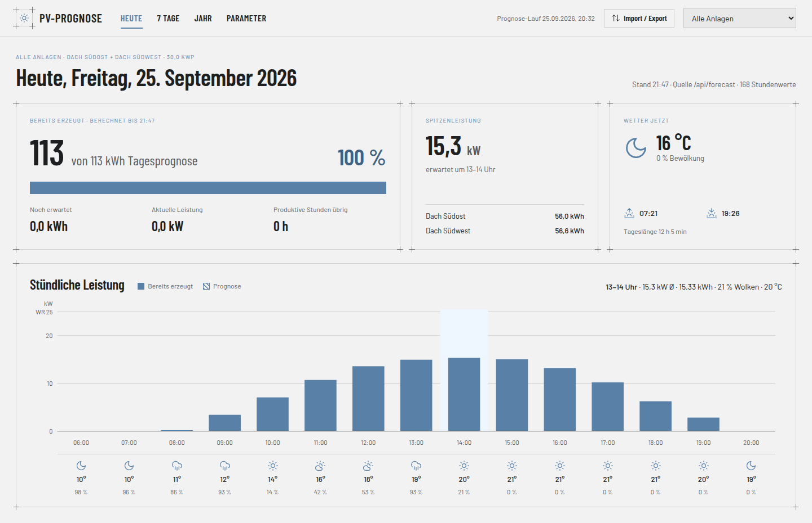

# python-pv-forecast

PV power forecast for one site with several PV systems, built on [pvlib](https://pvlib-python.readthedocs.io/) and the [Open-Meteo](https://open-meteo.com/) weather API. The default configuration is for the Kaiserstuhl region (Baden-Württemberg).

It fetches hourly weather forecasts, simulates each configured PV system and reports AC power and hourly energy per system and in total. You can use it as a command-line tool (CSV output) or through a browser dashboard.



## Setup

```bash
python -m venv .venv
.venv/bin/pip install -r requirements.txt
```

## Dashboard

```bash
.venv/bin/uvicorn server.app:app --reload               # add --port 8001 if 8000 is taken
```

Open http://localhost:8000/. On first load the server computes a fresh forecast from Open-Meteo. After that it recomputes whenever the stored forecast is older than 3 hours.

| Screen | Content |
|---|---|
| **Heute** | energy produced so far compared with the day's forecast, peak power, current weather, sunrise and sunset, hourly power chart with weather strip |
| **7 Tage** | one card per day (kWh, peak, temperature, cloud cover, sparkline) and the hourly chart for the selected day |
| **Jahr** | monthly energy from the Open-Meteo archive, the running month plus forecast, and an expectation for the open months (same month of the previous year) |
| **Parameter** | edit site, PV generator and model parameters per system; **Speichern & neu berechnen** saves them to `data/myconfig.json` and recomputes |

The power axis always runs up to the combined inverter AC limit of the selected systems, so days can be compared at a glance. Use the system selector at the top right to filter every screen. **Import / Export** loads or downloads CSV and parameter JSON.

The dashboard contains no measured data. "Bereits erzeugt" (already produced) is the forecast integrated up to the current time.

## Command line

```bash
python pv_forecast.py                          # 7-day forecast, printed to the console
python pv_forecast.py --output forecast.csv    # write results to CSV
python pv_forecast.py --forecast-days 3 --past-days 1
```

| Option            | Default              | Description                            |
|-------------------|----------------------|----------------------------------------|
| `--base-config`   | `data/config.json`   | Versioned defaults                     |
| `--config`        | `data/myconfig.json` | Local overrides on top of the defaults |
| `--latitude`      | from config          | Site latitude, overrides the config    |
| `--longitude`     | from config          | Site longitude, overrides the config   |
| `--timezone`      | from config          | Output timezone, overrides the config  |
| `--forecast-days` | 7                    | Days to forecast                       |
| `--past-days`     | 0                    | Past days to include                   |
| `--output`        | –                    | CSV file for the results               |

The CLI and the dashboard use the same configuration and produce identical values.

### Output

One row per hour with these columns:

- `time`: timestamp in the site's timezone
- `<system>_P_ac_W` / `<system>_E_kWh`: AC power and hourly energy for each active system
- `P_total_ac_W` / `E_total_kWh`: sum over all active systems
- `temp_air_C` / `cloud_cover_pct`: Open-Meteo air temperature and cloud cover

Each value is the energy for the hour *ending* at the timestamp, because Open-Meteo radiation is the mean over the preceding hour. The sun position is therefore evaluated at the interval midpoint. After the table, the script prints the peak total power and the total forecast energy.

## Configuration

Parameters are resolved value by value, highest priority first:

1. `data/myconfig.json`: local overrides saved by the dashboard. The file is git-ignored, so your own site never ends up in the repo.
2. `data/config.json`: versioned defaults (Kaiserstuhl).
3. Constants and `PV_SYSTEMS` in [pv_forecast.py](pv_forecast.py).
4. Defaults of `pv_libmdl.pv_yield_from_pvlib_model`.

A missing key or `null` falls through to the next level, so both files can be partial. A value under `site` applies to all systems. A value under `systems[i]` applies to that system only, matched by `name`, which is also the column prefix in the CSV.

```json
{
  "site":    { "latitude": 48.1, "longitude": 7.67, "altitude": 200, "timezone": "Europe/Berlin", "surface_tilt": 30 },
  "systems": [ { "name": "pv_system_1", "label": "Dach Südost", "kWp": 15, "surface_azimuth": 135, "p_inv_ac_kW": 12.5,
                 "faiman_u0": 20, "faiman_u1": 5, "wind_height_factor": 0.8, "gamma_pdc": -0.004,
                 "dc_cable_loss": 0.04, "system_loss": 0.14, "eta_inv_nom": 0.96, "dc_ac_ratio": 1.0,
                 "horizon_profile": { "0": 0, "200": 0, "220": 10, "270": 15 } } ]
}
```

- Losses and η are fractions (`0.04`). The dashboard shows them as percentages.
- `horizon_profile` maps azimuth to obstruction angle in degrees. Direct irradiance is dropped while the sun is below the profile.
- Values are validated, for example losses 0–1, azimuth 0–360 and tilt 0–90. An invalid value is rejected with the field name, and nothing is written.

Defaults in `data/config.json`:

| System        | kWp | Azimuth           | Inverter AC |
|---------------|-----|-------------------|-------------|
| `pv_system_1` | 15  | 135° (south-east) | 12.5 kW     |
| `pv_system_2` | 15  | 225° (south-west) | 12.5 kW     |

| Parameter           | Value            |
|---------------------|------------------|
| Site                | 48.10 °N, 7.67 °E, 200 m |
| Module tilt         | 30°              |
| DC cable loss       | 4 %              |
| System loss         | 14 %             |
| Inverter efficiency | 96 %             |
| Faiman U0 / U1      | 20 / 5           |
| Wind height factor  | 0.8              |

## API

The dashboard server ([server/app.py](server/app.py)) provides the following endpoints. Interactive docs are at `/docs`.

| Method | Path | Purpose |
|---|---|---|
| GET | `/api/forecast` | hourly forecast as CSV (same format as the CLI) |
| GET / PUT | `/api/systems` | effective config / save the full config to `myconfig.json` |
| PATCH | `/api/systems/{name}` | change single fields of one system |
| PATCH | `/api/site` | change site fields |
| DELETE | `/api/systems/{name}/overrides` | remove local overrides, back to the defaults |
| GET | `/api/defaults` | defaults without local overrides |
| POST / GET | `/api/run?days=7` | recompute in the background / run status |
| GET | `/api/archive?year=YYYY` | monthly energy per system from the Open-Meteo archive (lags about 2 days behind) |
| GET | `/api/sun?days=8` | sunrise and sunset per day (pvlib SPA) |

Generated files (`data/forecast.csv`, `data/archive_*.csv`) and the Open-Meteo request cache are git-ignored.

## Tests

```bash
.venv/bin/pytest
```

The tests use fixed weather data and need no network access.

## Files

- [pv_forecast.py](pv_forecast.py): CLI, configuration resolver and prediction
- [pv_libmdl.py](pv_libmdl.py): pvlib model chain (sun position → POA → Faiman cell temperature → PVWatts DC/AC)
- [weather_openmeteo.py](weather_openmeteo.py): Open-Meteo forecast and archive client with request caching
- [server/app.py](server/app.py): FastAPI backend for the dashboard
- [frontend/](frontend/): dashboard, currently the design prototype wired to the API (design handoff in [docs/design_handoff/](docs/design_handoff/README.md))
- [data/config.json](data/config.json): versioned default parameters
- [tests/](tests/): acceptance tests for configuration, API and CLI
